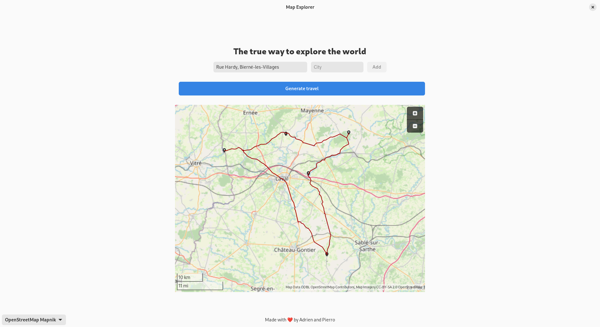

# Map explorer 🗺️

Map Explorer is a project made with [BugProg](https://github.com/BugProg) for a school rush in 10 days. It consists of solving the salesman problem using a binary heap dijkstra with an Ant Colony Optimization. We also made an addresses autocomplete, with spatial hashing to recover the nearest intersection from the address, to run the ACO.

# README For teachers :

## Please first download the project with maps assets here: [Project depo](https://www.home-cloud.fr/s/oHgKTSg4zJ4jSfT)
It contains addresses from Mayenne, Mayenne Graph, Mayenne Intersections and laval.

[//]: # (To view this page with graphic comfort please follow this link:)
[//]: # (https://github.com/0xPierre/ClassificationTP)

#### A new way to explore the world




Map explorer is built with kind of Technologies😃:  
[](https://scratch.mit.edu/)
[](https://kernel.org)
[](https://www.gtk.org/)

## General Info


- **Members:** Adrien et Pierre
- **Memory consuption:** Depending on the number of addresses. When loading the mayenne addressed graph. The memory consumption is less than 1GB. When running with all the addresses, the memory taken is more or less 12GB.

### Project Structure

- TP-2A-S4
    * `data`  Assets folder
      * `ressources`
        * `Data` Contains graphs and addresses.
    * `graph_visualisation` Extern program (Nodejs et python) for graph visualisation
    * `output` Ouput folder gor generated geojson ( Not used for review )
    * `po` Language files
    * `src` Main programs source 

## Features 🚄

- Binary Heap (Adrien)
- Path Matrix, GeoJSON writer (Pierre) 
- Heuristic (Pierre)
- ACO (Pierre)
- User interface (Adrien)
- Genetic Algorithm and hyperparameters search (Adrien)
- Bruteforce with N! (Pierre)
- Address & City Search/AutoCompletion (Pierre)
- Spatial Map/Hashing, detection of the nearest intersection (Pierre)
- CSV parser, CSV writer (Pierre)
- Optimisation ACEO :
  - Pheromone initialisation with Glouton (Pierre)
  - Equal random probability sometimes (Pierre)
  - Inverse probability (Pierre)
- Graph plannarity / 2opt (Adrien/Pierre)
- Logger, Timer, file utils, text utils,.... (Pierre)
- CLI (Pierre)
- Beautiful Graph visualisation (Adrien/Pierre)

**More details below 👇️**

##### User interface
In order to have a better user experience, we designed a beautiful interface

We made the choice to use GTK/libadwaita, the most popular cross-platform GUI utility in c for a Linux-based operating system.

This is the following step to use the interface:

- Enter an address in the text input
- Click on the address show in the pop-up list.
- Click on 'Add', a point should appear on the map.
- Add more destinations. (Make sure to do not select the same twice)
- When you have enough destion you can generate the travel.

##### Genetic Algorithm
The Genetic Algorithm is used to find the best hyperparameters for the ACO.
The execution of the Genetic Algorithm can take up to 20 mins.

##### CLI
A CLI option has been added to generate travel without using the UI.

##### ACO
To run different ACO, refers to the `src/Settings.h` file.

## How to build

There are two ways to build our project. In this section, we will cover both.

In the first part of the following tutoriel, we will use Gnome Builder the only way to build the project easily to have the UI.
In the second part, we will cover how to build the app with gcc.

# ATTENTION
- THE UI IS ONLY AVAILABLE WITH GNOME BUILDER.
- THE REST IS ONLY AVAILABLE WITH GCC.

### Build with Gnome Builder

Gnome Builder is a great IDE developed by the Gnome team to create app based on GTK and the modern library Libadwaita.
First, we need to install gnome builder. We will use the Flatpak (another awesome Gnome project) manager to be certain that everything will work well even on computer with very old OS 🤪.

Most of the Linux distribution has Flatpak installed. If it's not the case, please run: `sudo apt install flatpak`.
To have more details, please refer to this doc: [Flathub Setup](https://flathub.org/setup)

Once this step is done, we can now install Gnome Builder like this.

```shell
flatpak install flathub org.gnome.Builder
```

If you never installed app, the process can take a while...⌛️

Now you can launch Gnome builder like this:

```shell
flatpak run org.gnome.Builder
```

If it's not done, You can download the project with maps assets here: [Project depo](https://www.home-cloud.fr/s/CxTpFrEzSEZ23jW)

Once it's downloaded and unzipped, the folder can be opened by Gnome Builder.

The IDE might ask you to download some missing depedencies. Instal them otherwise you have some troubles.

Before run the program we have to check if the UI is enabled in `src/Settings.h`.
Make sure that the following lines are correct:

```c
#define UI_ENABLED true
#define RUN_CLI false
```

Run the project by clicking on the ▶️ icons or by the keyboard shortcut: `ctrl + shit + space`.

The build can take a while (~5 mins)... ⌛️ 

Once the build is done, you can play with our wonderful app.

**Know limitations:**
- Avoid entering the same address twice

### Build with GCC

Gcc is the most popular tool to build c written program.

⚠️ **WARNING**
If you want to have the UI please refer to Gnome Builder build. ⚠️
UI is not available and give errors with gcc.

Please refer to the FAQ (at the end of the file) to enable/disable components.

Install common depedencies with:

```shell
sudo apt install build-essential
```

Open a terminal at the root of the project folder and run the following command:


```shell
bash ./make.sh
```

The command generate a `a.out` file. You can simply execute it to launch the program.

## FAQ

### How to use `settings.h` ?

You can enable or disable every part you want. But make sure to enable only one big feature simultaneously

#### Enable/Disable CLI

```c
#define RUN_CLI true/false
```

## How to contribute 🚀

Thank you for your contribution to the open source world !😍

- Contact us by email
- Open a MR

## Support 🛟

If you need assistance or want to ask a question about map explorer, you are welcome to ask for support. If you have found a bug, feel free to open a new Issue on Gitlab.

## Licence 📜

The app core is under GPLv3.
